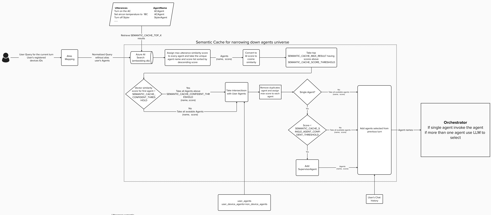
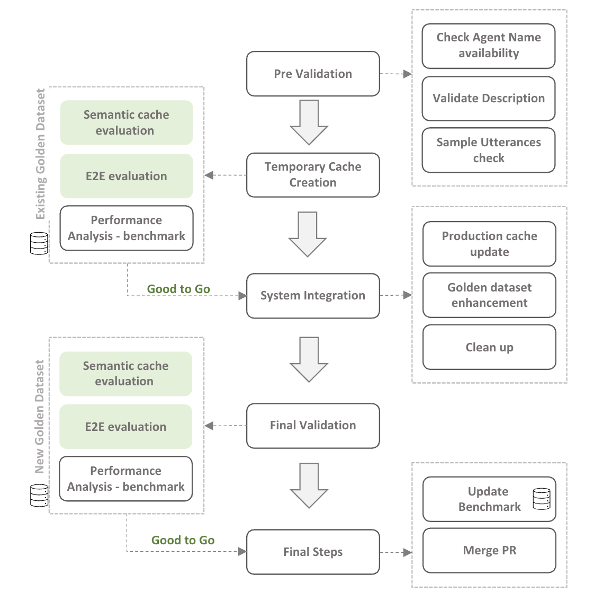
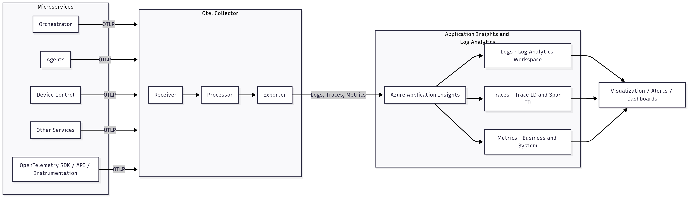

# Dynamic AI Agents at scale pattern

This architecture describes a multi-agent agentic solution, that allows dynamic selection of probable agents in a conversation out of a big universe of 100s of agents. The architecture explains the key challenges in building a dynamic inclusion agentic system, possible orchestration options and evaluating the system as it scales to 100s of agents.

This architecture applies Azure AI Foundry, Azure AI Search, Azure Open AI in Azure AI Foundry models, and other azure services to build a scalable agentic solution.

The architecture is mostly valid for use-cases where there are many agents involved in open-ended conversations with the clients, and conversation domain is not fixed.

# Key Challenges

## Dynamic inclusion of agents

Imagine that your organization has multiple domain specialized agents, and you want to build a single conversation AI which allows the clients to use any of these agents, without excatly being concerned about which agent is doing the work. In addition, there can be situations where more than one agent is being used in a single conversation (multi-intent scenario), for example - "Help me book a conference room in Yosemite floor, and inform the parking services that I may need 5 spots for customers meeting on 26th." - This use case could be using ConferenceBooking Agent, as well as the ParkingServiceAgent to do both works. Essentially, it's a simple problem to solve when the number of agents/tools is smaller (like under 20), and mostly [function calling](https://learn.microsoft.com/en-us/semantic-kernel/concepts/ai-services/chat-completion/function-calling/?pivots=programming-language-python) pattern does a good job.
Choosing which particular function before adding in a conversation is one of the key challenges here, when the list of agents grow longer.

## Cost optimization

Some caveats of function calling are

1. Doesn't scale well with larger number of functions - Maximum limit being 19.
2. Token count increases as number of functions increase
3. With Token count the cost and time both increase

Return on investment is a big concern for all agentic systems, Token count is a big factor in agentic system costs. As the number of agents in system grow, the context window of the system increases to retain more knowledge about all the agents/functions in the system and the cost keeps growing.

## Orchestration

There are many options in orchestrating a multi-agent conversation; options like Group chat, Handoff, concurrent, sequential, Magentic etc.
A key challenge is to figure out, what is the orchestration pattern for your business in particular cases? In multi-agent systems - specialized agents are built to converse with each other or do a job after one another, while in many systems the nature of each agent can be stark different and yet the client's may expect multiple agents to finish the job concurrently.
In this architecture, we will put out a view point on possible selection of orchestration pattern when working at a dynamic scale, as at dynamic scale the nature of exact business and relations within agents may not be always known.

## Evaluating as system evolves

As you build an agentic solution, it's vital to keep evaluating your system. Both Agent, as well as orchestration and impact of a new agent on overall system needs to be evaluated.

# Architecture

## System Design High-level

Diagram of high level infrastructure and services, Then sections on each component double click

## Workflow

## Components

### Agent Selection

The Agent Selector is designed to efficiently identify and choose the most appropriate agents for addressing user inquiries from an extensive pool of candidates. Through the integration of Azure AI Search—leveraging vector similarity as a semantic cache—to narrow the list of agents, followed by the application of a Large Language Model (LLM) to select from this refined group, the system ensures contextually-aware agent selection. This methodology enhances subsequent processes, promoting effective inter-agent and agent-user interactions to produce responses or actions aligned with the user's query. This document provides an overview of the key components and workflow that underpin the Agent Selector.

The structure of the Agent Selector system is illustrated in the following diagram:

#### Workflow Summary

User Query → Alias Mapping → Semantic Search (Azure AI Search) → Agent Scoring & Filtering → Orchestrator (Select & Invoke Agent)

1. User submits a query along with registered agent IDs.
2. Query goes through alias mapping to get a normalized query.
3. Normalized query is sent to Azure AI Search (semantic cache) to find top matching agent utterances.
4. Each agent is assigned the highest similarity score based on vector similarity scores of the normalized query with utterances in the semantic cache.
5. Agents with scores above predefined thresholds are shortlisted.
6. Candidate agents are intersected with the user’s registered agents.
7. Remove duplicate agents by retaining only the highest similarity score for each agent based on matched utterances.
8. If a single agent remains and its score exceeds the confidence threshold, select that agent. If not, include the SupervisorAgent for further evaluation.
9. Incorporate agents from the previous conversation turn using chat history.
10. Final agent list is sent to the Orchestrator.
11. Orchestrator invokes the single agent directly, or uses an LLM to select if multiple agents are available.

#### Evaluation criteria

### Multi-Agent Orchestration

A well-designed orchestration layer is essential for coordinating interactions among multiple AI agents. As both the number of agents and the complexity of user scenarios grow, the orchestration system must enable agents to work together effectively, complete tasks accurately, and preserve conversational context. The choice of orchestration pattern depends on various factors such as the nature of user queries, the degree of agent collaboration required, and the overall system goals.

One can choose from various orchestration patterns to address specific solution needs. For detailed guidance on selecting and implementing these patterns, see [AI agent orchestration patterns](https://learn.microsoft.com/en-us/azure/architecture/ai-ml/guide/ai-agent-design-patterns).

For scenarios that require minimal degree of collaboration/conversation between agents, one may consider using "Agents as Tools" pattern. In this approach, a principal agent acts as the main co-ordinator, invoking other agents as "tools" to fulfill specific tasks. The principal agent interprets user intent and determines which agents to call using the function calling capabilities of large language models. For more details, see [Agents as Tools pattern](<<ToDo: Link to Agents as Tools>>).

**Recommended scenarios for the Agents as Tools pattern:**

1. The user's request is straightforward and does not require extensive collaboration or reasoning among agents.
2. The solution involves a limited set of agents, usually two or three, to fulfill the task.
3. Each agent operates within a well-defined scope, with responsibilities that do not overlap.

#### Multi-Turn Scenarios

Multi-turn interactions require the orchestration layer to maintain continuity by providing relevant context from previous requests to the participating agents. The orchestration system should determine when to summarize, prune, or persist the conversation state to optimize performance and relevance.

A simplistic approach to augment our request with prior context can be implemented by storing the relevant conversation history in a low-latency cache, such as Azure Cache for Redis, indexed by conversation ID along with a configurable time-to-live (TTL) value to control retention. The TTL can be adjusted based on business needs, such as using a rolling TTL for ongoing conversations.

For more advanced agent memory strategies, see [Agent Memory](https://learn.microsoft.com/en-us/agent-framework/user-guide/agents/agent-memory).

#### Adaptive Orchestration: Direct Agent Invocation vs. Orchestrator Path

While the orchestration module is central to coordinating agent interactions, there can be scenarios where its involvement may be unnecessary. Specifically, if the agent selection process—using semantic cache and vector similarity—yields a single agent with a confidence score exceeding a defined threshold (such as 85%), the system can invoke that agent directly. This approach eliminates unnecessary orchestration overhead, minimizing additional agent selection steps, reducing both latency and token consumption associated with additional LLM calls.

Direct invocation is most suitable for unambiguous, single-intent queries where the probability of successful agent resolution is high. For queries exhibiting multi-intent or ambiguity, the orchestrator layer remains essential for advanced agent coordination and reasoning.

By incorporating this adaptive orchestration strategy, the architecture balances performance optimization with functional flexibility. It ensures rapid response for straightforward tasks and robust coordination for complex scenarios.

### Agent Implementation Approaches

When designing a dynamic large scale multi-agent system, there are different implementation approaches, each offering distinct benefits depending on the scenario.

#### In-Code

Agents are defined programmitically in the application code and with the help of frameworks like [Microsoft Agent Framework](https://learn.microsoft.com/en-us/agent-framework/overview/agent-framework-overview), [LangChain](https://www.langchain.com/) etc.

**Advantages:**

- Maximum control over agent logic and behavior.
- Direct integration with existing application infrastructure.
- Efficient runtime performance through direct code execution.
- Rich debugging and testing capabilities.

**Considerations:**

- Requires proficiency in the respective programming language and framework used for agent implementation.
- Updating or onboarding new agents requires code changes and redeployment.
- Higher maintenance overhead as the system scales.

#### Declarative

Declarative agent definitions allow you to declare agent capabilities, prompts, and workflows in configuration files like [YAML](https://yaml.org/). This approach separates agent logic from application code, enabling non-developers to modify agent behavior without code changes.

**Advantages:**

- Easier to introduce new agents into the system without requiring code changes or redeployment.
- Non-technical team members can also contribute to defining agent behavior.
- Faster iteration cycles for agent updates.
- Clear separation of concerns between infrastructure and agent logic.

**Considerations:**

- Agent behavior and capabilities are restricted to what gets defined as part of the YAML schema. Extending functionality beyond these predefined patterns may require significant changes or custom development.
- Validation and testing processes need to be established for YAML changes.

**Selection Criteria:**
When selecting an implementation approach, consider the following parameters:

- **Extensibility:** Determine how readily the approach supports adding new agents and capabilities in the system.
- **Maintainability:** Consider the effort required to update, debug, and monitor agents as requirements evolve.
- **Performance requirements:** Consider latency, throughput, and scalability needs based on expected usage patterns.
- **Scalability:** Assess how well the approach supports increasing numbers of agents and higher workloads.
- **Community Support:** Assess the availability of documentation, community resources, and official support for the chosen approach.

Additionally, the architecture should support multiple implementation approaches simultaneously, allowing you to choose the most appropriate option for each agent based on its specific requirements and constraints.

### Agent Factory

The Factory Design Pattern is a well-established approach for creating objects where the system needs to manage and instantiate a variety of objects dynamically.
When building a scalable multi-agent system, consider adding an AgentFactory in your architecture to centralize how agents are created and to decouple creation logic from runtime use. Given an agent name, the factory returns a ready-to-use agent instance regardless of its implementation (code, YAML template, etc.). This lets you add new agent types without changing orchestration logic.

#### Key Design Considerations

- The factory inspects available representations (code module, YAML, other) and instantiates the appropriate implementation.  
- Allow configurable priority (for example, prefer YAML template over code) so you can control which implementation is used when multiples exist.  
- Include validation, lightweight instantiation checks, and caching to avoid repeated heavy construction.  

The Agent Factory pattern streamlines onboarding, testing, and evolution of an agent catalog, and preserves modularity and scalability by isolating agent changes from other system components.

### LLM Integration Standards & Protocols

#### Model Context Protocol (MCP)

[MCP](https://modelcontextprotocol.io/docs/getting-started/intro) is an open-source standard for connecting AI applications to external systems. MCP enables agents to connect to various systems through a unified interface, promoting interoperability and reducing integration complexity.

**Advantages:**

- Widely adopted open-source standard for connecting large language models (LLMs) to external data, tools, and services, supported by an active industry community.
- Vendor-agnostic approach supporting multiple service providers.
- Simplified agent development through reusable MCP servers.
- Accelerates development by enabling you to build or integrate with existing MCP servers, reducing the need to create new integrations for each service.

**Considerations:**

- MCP is a relatively new protocol, and its ecosystem is still maturing.
- Security standards and specifications are also evolving quickly.

### Agent-to-Agent Protocol (A2A)

The Agent-to-Agent Protocol (A2A) defines a standardized communication framework that enables agents operating outside the core orchestrator to participate seamlessly in multi-agent conversations. This protocol is essential for architectures where agents are distributed across different systems, organizations, or infrastructure boundaries while maintaining cohesive collaboration.

**Advantages:**

- Enables distributed multi-agent architectures across organizational and infrastructure boundaries.
- Supports both synchronous and asynchronous communication patterns for diverse agent interaction scenarios.
- Provides robust security framework with authentication, authorization, and end-to-end encryption.
- Built-in observability and monitoring capabilities for distributed tracing and performance tracking.
- Seamless integration with existing enterprise systems and third-party agent frameworks.

**Considerations:**

- Requires additional infrastructure for service discovery, load balancing, and message routing.
- Network latency and reliability become critical factors in cross-system agent communications.
- Security complexity increases with distributed authentication and authorization across system boundaries.
- Protocol versioning and backward compatibility management needed as the system evolves.

### Evolution of system - Creating/updating Agents

## Evaluation Framework

Details around a possible structure of an evaluation framework

## Agent Onboarding Process

The idea behind this process is to maintain a high-quality, conflict-free multi-agent system where every agent addition, update, or removal is deliberate and validated. Agents are the building blocks of intelligent orchestration, so introducing or modifying one without checks can lead to degraded performance, overlapping responsibilities, or broken user experiences. To prevent this, the lifecycle emphasizes evaluation-driven governance at every stage. Below is a flow diagram of the onboarding process.

The process starts with onboarding a new agent, which involves verifying the uniqueness of its name, description, and sample utterances. Once validated, a temporary semantic cache is created, and the system runs semantic and response evaluations to ensure the new agent doesn’t negatively impact existing ones. If results meet benchmarks, the agent is promoted to production, and the golden dataset—our ground truth for evaluations—is updated to reflect the new capabilities. Similarly, when updating an agent, the same validation and regression checks apply to avoid selection drift. Updating the golden dataset is critical for keeping evaluations aligned with real-world usage, while deleting an agent requires careful decommissioning steps to remove dependencies and maintain system integrity. This structured approach ensures scalability without sacrificing accuracy or reliability.

## Observability

When building AI solutions—especially those powered by **multi-agent architectures**—reliability, maintainability, and performance are non-negotiable.  
However, as these systems expand in scale and complexity, maintaining visibility into their behavior becomes increasingly difficult.

Unlike traditional applications, agentic systems involve multiple intelligent components that collaborate dynamically: language models, orchestration layers, caching mechanisms, retrieval engines, and external APIs.  
Each component contributes to the outcome, which makes **monitoring, debugging, and optimization** far more intricate.

That's where **observability** becomes essential—not as a buzzword, but as the foundation for understanding emergent AI behavior.

## Why observability matters in AI systems

Observability provides insight into what your application is doing—not just whether the underlying infrastructure is running. You need to distinguish between **system observability** (infrastructure metrics like CPU, memory, and network) and **application observability** (orchestration logic, agent behavior, prompt flows, and model inference).

In multi-agent environments, application observability answers questions such as:

- Why did one agent take longer to respond than others?  
- What sequence of calls led to a poor or inconsistent result?  
- Which model parameters or prompts were in play during a failure?  

By combining signals from infrastructure, orchestration, and model behavior, observability bridges the gap between **system performance** and **model intelligence**.

## Our observability framework

We've built our observability framework on **OpenTelemetry** for instrumentation and **Azure Application Insights** as the telemetry backend.  

- **OpenTelemetry** standardizes how traces, metrics, and logs are captured across agents and services. It ensures interoperability across frameworks and programming languages.  
- **Application Insights** aggregates and visualizes this telemetry—offering dashboards, alerts, and the ability to explore correlations between infrastructure metrics, application traces, and LLM inference data.

For agents built with **Semantic Kernel**, observability is integrated through OpenTelemetry's standardized instrumentation. Semantic Kernel automatically emits traces, logs, and metrics for kernel operations such as function invocations, prompt executions, and plugin calls when you configure OpenTelemetry.

## The three dimensions of agentic observability

Traditional observability stops at *logs, metrics, and traces*.  
In AI systems, we extend those pillars to include **semantic and behavioral observability**—how agents reason, collaborate, and evolve during execution.

#### 1. Execution logs  
Beyond infrastructure logging, we capture **semantic events**: prompts, responses, and intermediate reasoning steps between agents.  
All log data is streamed via **OpenTelemetry exporters** to **Azure Log Analytics**, where we use **KQL** to correlate across agents and identify anomalies at the conversation level.

#### 2. System and model metrics  
Metrics provide quantitative signals about both system and model performance.  
We track latency, throughput, and cost—but also **AI-specific metrics** such as token usage, TTFT etc. 

#### 3. Distributed traces with context  
Traces connect every service and agent involved in a single conversation.  
By using **trace IDs** and **span IDs**, we can view the full path of an inference request—from the orchestrator to downstream agents, caches, and external calls.

Each trace carries **semantic context**, such as conversation ID and agent name, enabling a unified view of model collaboration.  
This is particularly useful for diagnosing latency spikes, identifying network bottlenecks, or analyzing where agent coordination might fail.

## Observability data flow for agentic systems

1. **Instrumentation:** Agents and services are instrumented with OpenTelemetry to emit logs, traces, and metrics.  
2. **Export:** Data flows to **Azure Application Insights** via OpenTelemetry SDKs.  
3. **Storage & Querying:**  
   - Logs → Log Analytics (KQL for cross-agent queries)  
   - Traces → Transaction Search and distributed trace view  
   - Metrics → Azure Metrics Explorer  
4. **Visualization & Alerting:** Azure Monitor dashboards track real-time performance, with rule-based alerts triggering incident response workflows.

A single trace ID flows through the entire conversation lifecycle—from the initial request to the orchestrator, through agent invocations, function tool calls, and external API services. Each component creates child spans under the parent trace, allowing you to reconstruct the complete execution path and identify where latency or errors occurred across agents and auxiliary services.

## Observability for LLM and agent systems

For LLM-driven architectures, observability must capture **the cognitive layer**—what the model or agent saw, decided, and produced.

We track not just infrastructure telemetry, but contextual data such as:

- **System prompts:** The instructions that guided behavior.  
- **Model parameters:** Temperature, top-p, token limits.  
- **User inputs and conversation history:** What context was passed to the model.  
- **Outputs:** The actual text, decisions, or structured responses.  

Capturing this metadata enables **reproducibility** of inference runs—helping data scientists analyze why an output differed, whether drift occurred, or if bias emerged.

## Key metrics categories

Track **system performance** metrics (latency, throughput, resource utilization, reliability) and **LLM inference performance** metrics (TTFT, token usage, error rates, content safety triggers). Additionally, monitor **usage and engagement** patterns (active conversations, conversation depth, repeated queries) and **quality and model accuracy** indicators (intent selection accuracy, sentiment trends, instruction adherence, bias and groundedness).

## Best practices

- **Uniform Instrumentation:** Apply OpenTelemetry consistently across all microservices and agents.  
- **Correlation IDs:** Include trace and span IDs in every log and metric.  
- **Sampling and Retention:** Balance data richness with cost efficiency using intelligent sampling.  
- **Dashboards and Alerts:** Define SLIs/SLOs and automate alerting for anomalies.  
- **Secure Data Handling:** Mask or omit sensitive information from logs and traces.  
- **Cross-functional Collaboration:** Engineers, data scientists, and product teams should share a unified observability view.